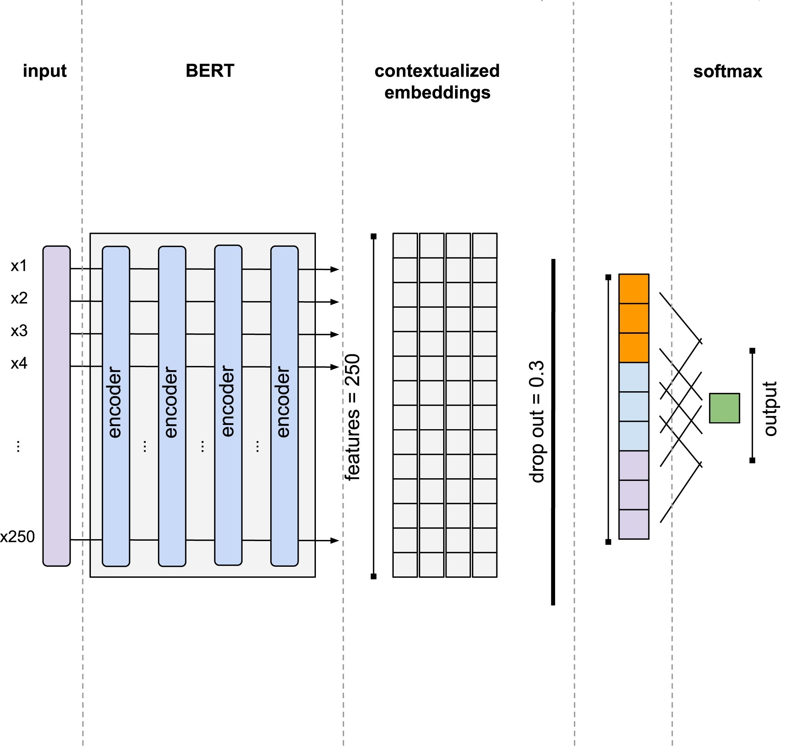

# twitter-sentiment-analysis


<!-- Improved compatibility of back to top link: See: https://github.com/othneildrew/Best-README-Template/pull/73 -->
<a name="readme-top"></a>

[![Contributors][contributors-shield]][contributors-url]
[![LinkedIn][linkedin-shield]][linkedin-url]


<!-- PROJECT LOGO -->
<br />
<div align="center">
  <h3 align="center">Twitter sentiment analysis</h3>
  <p align="center">
    Twitter sentiment analysis using BERT contextual embeddings
    <br />
    <a href="https://github.com/othneildrew/Best-README-Template/issues">Report Bug</a>
  </p>
</div>


<!-- TABLE OF CONTENTS -->
<details>
  <summary>Table of Contents</summary>
  <ol>
    <li>
      <a href="#about-the-project">About The Project</a>
      <ul>
        <li><a href="#built-with">Built With</a></li>
      </ul>
    </li>
    <li>
      <a href="#getting-started">Getting Started</a>
      <ul>
        <li><a href="#prerequisites">Prerequisites</a></li>
        <li><a href="#installation">Installation</a></li>
      </ul>
    </li>
    <li><a href="#usage">Usage</a></li>
    <li><a href="#roadmap">Roadmap</a></li>
    <li><a href="#contributing">Contributing</a></li>
    <li><a href="#contact">Contact</a></li>
    <li><a href="#acknowledgments">Acknowledgments</a></li>
  </ol>
</details>


<!-- ABOUT THE PROJECT -->
## About The Project

There are many great README templates available on GitHub; however, I didn't find one that 

Here's why:
* Your time should be focused on creating something amazing. A project that solves a problem and helps others
* You shouldn't be doing the same tasks over and over like creating a README from scratch
* You should implement DRY principles to the rest of your life :smile:

Of course, no one template will serve all projects since your needs may be different. So 

Use the `BLANK_README.md` to get started.

<p align="right">(<a href="#readme-top">back to top</a>)</p>

### Built With

<a href="#">  </a>
<a href="#">  </a>
<a href="#">  </a>
<a href="#">  </a>


## Installation instructions 
Create a python 3.8 virtual environment: ``` python3 -m venv <name_of_virtualenv>```
Activate the virtual environment: ```source new_env/bin/activate```
Install the standard Data science tools for python. <br>
Additional libraries required. <br>
Install manually
```
pip install nltk==3.7
pip install torch==1.12.1
pip install transformers==4.22.2
```
Install the packages given in the *requirements.txt*
```
pip install -r requirements.txt
```

<p align="right">(<a href="#readme-top">back to top</a>)</p>


<!-- Installation instructions  -->
## Installation instructions 

This is an example of how you may give instructions on setting up your project locally.
To get a local copy up and running follow these simple example steps.

### Prerequisites

Create a python 3.8 virtual environment: ``` python3 -m venv <name_of_virtualenv>```
Activate the virtual environment: ```source new_env/bin/activate``` <br>
Install the standard Data science tools for python. <br>

Install manually
```
pip install nltk==3.7
pip install torch==1.12.1
pip install transformers==4.22.2
```
Install the packages given in the *requirements.txt*


### Installation

_Below is an example of how you can instruct your audience on installing and setting up your app. This template doesn't rely on any external dependencies or services._

 
1. Clone the repo
   ```sh
   git clone https://github.com/MajdAlkawaas/twitter-sentiment-analysis.git
   ```
2. Download the datasets
    1. Use the following link. 
    2. Extract the file in the same directory as the data_preprocessing.ipynb notebook
3. Open the data_preprocessing.ipynb notebook 
    1. For downloading the jupyter notebook follow the instruction 
   <a herf="https://docs.jupyter.org/en/latest/install/notebook-classic.html">here</a>


<p align="right">(<a href="#readme-top">back to top</a>)</p>


<!-- USAGE EXAMPLES -->
## Usage instructions

After following the download instructions you can start with the following:
1. Adjust the `BASE_PATH` variable in the data_preprocessing.ipynb notebook to the path of the home directory where you cloned the repo.
2. Run the code in the data_preprocessing.ipynb notebook.
3. After running all the code cells in the mentioned notebook you will have a new .csv file with the name `preprocessed_dataset.csv` stored in the `BASE_PATH` you have chosen earlier.
4. Close the data_preprocessing.ipynb notebook
5. open the training.ipynb notebook.
6. Change the value of `BASE_PATH` to the same value used earlier
7. Choose a value for the `EPOCHS` 
8. Choose a value for the `portion` which controls that percentage you are using from the total size of the dataset.
9. Optional: pass a value for the parameter `frozen` when initiating the `BertClassifier` object this, parameters controls whether the BERT's parameters are frozen or not. (`frozen = True` BERT parameters are not being trained only the classification layer) Default value `frozen = False`
10. Optional: pass a value for the parameter `dropout` for the dropout layer, default value `dropout = 0.5`


<p align="right">(<a href="#readme-top">back to top</a>)</p>


## Method and approach
We were trying to figure out what kind of results we will get by training BERT with a custom classification layer on multiple different small amounts of data and see how much the performance is going to improve with the extra data.

1. We started with four dataset that we will go further about in the data section
2. Performed data preprocessing which included:
   1. Labels encoding
   2. Dropping duplicates and Nulls
   3. Removing stopwords (NLTK English stopwords list)
   4. Removing links, symbols ...etc (Using Regex expressions)
   5. Stemming (Using porter stemmer from NLTK)
3. Fine tuned a pre trained BERT model from huggingface's transformers library (bert-base-cased)
4. Added a custom classification layer which consisted of:
   1. BLAH

<br>
 
   

## Data

We have combined multiple datasets to create a dataset of 1.76 Million tweets.
We have used the following datasets:
1. <a href="https://www.kaggle.com/datasets/kazanova/sentiment140">Sentiment140 dataset</a> (1.6 million tweets)
2. <a href="https://www.kaggle.com/datasets/crowdflower/twitter-airline-sentiment">US Airline Sentiment</a> (14.6K tweets)
3. Professors dataset (465 tweets)
4. <a href="https://www.kaggle.com/datasets/saurabhshahane/twitter-sentiment-dataset">Twitter Sentiment Dataset</a> (163K tweets)

we are using a train 75%, val 12.5%, test 12.5% split

### Issues with the datasets:

1. Each dataset has a different label encoding for example the Sentiment140 encodes the positive, neutral, negative classes as 4, 2, 0 respectively. This issue required unifying the label encoding through out the four datasets.
2. Lack of tweets within the neutral class, the sentiment140 dataset documentation claims that it includes a neutral class tweets but no such tweets were found upon inspection. The US Airlines Sentiment dataset contained some tweets with the neutral class.
3. Removal of the neutral class from the merged dataset, given the relatively small number of neutral tweets (14 times less than either of the other two classes) the neutral class has been removed given that the model will most like sees those tweets as noise.


The total number of tweets after removing the neutral class and nulls, Nan is
1.7 Million tweets.

## Results

We have trained the model multiple times using different amounts of data and hyperparameters the following table provides a summery.

| Epochs | Train data size | Train accuracy | Validation accuracy | Test Accuracy | F1 Score |
| ------ | --------------- |--------------- | ------------------- |-------------- | -------- |
| 4      |0.1              |0.850           | 0.779               | 0.770         | 0.77     |
| 4      |0.01             |0.895           | 0.730               |0.732          | 0.758    |
| 4      |0.05             |0.901           | 0.751               | 0.748         | 0.758    |


## Discussion

Our results and approach suggests some questions that require a discussion

### How much of this extra training or data made a difference?
As we can see from the first row of the results that the model started to overfit during the forth epoch nonetheless, it achieved the highest F1 score with 1% percent of the training data. The second and third training instances achieved similar results with 10 times or 2 times less data. These results suggests that for this specific model more data may not result in better results.

### Is the architecture of classification layer effective?


### Is BERT base the right way to do it?


<!-- CONTRIBUTING -->
## Contributing

Contributions are what make the open source community such an amazing place to learn, inspire, and create. Any contributions you make are **greatly appreciated**.

If you have a suggestion that would make this better, please fork the repo and create a pull request. You can also simply open an issue with the tag "enhancement".
Don't forget to give the project a star! Thanks again!

1. Fork the Project
2. Create your Feature Branch (`git checkout -b feature/AmazingFeature`)
3. Commit your Changes (`git commit -m 'Add some AmazingFeature'`)
4. Push to the Branch (`git push origin feature/AmazingFeature`)
5. Open a Pull Request

<p align="right">(<a href="#readme-top">back to top</a>)</p>


<!-- CONTACT -->
## Contact

Your Name - [@your_twitter](https://twitter.com/your_username) - email@example.com

Project Link: [https://github.com/your_username/repo_name](https://github.com/your_username/repo_name)

<p align="right">(<a href="#readme-top">back to top</a>)</p>


<!-- ACKNOWLEDGMENTS -->
## Acknowledgments

Use this space to list resources you find helpful and would like to give credit to. I've included a few of my favorites to kick things off!


* [GitHub Emoji Cheat Sheet](https://www.webpagefx.com/tools/emoji-cheat-sheet)
* [Malven's Flexbox Cheatsheet](https://flexbox.malven.co/)
* [Malven's Grid Cheatsheet](https://grid.malven.co/)
* [Img Shields](https://shields.io)
* [GitHub Pages](https://pages.github.com)
* [Font Awesome](https://fontawesome.com)
* [React Icons](https://react-icons.github.io/react-icons/search)

<p align="right">(<a href="#readme-top">back to top</a>)</p>


<!-- MARKDOWN LINKS & IMAGES -->
<!-- https://www.markdownguide.org/basic-syntax/#reference-style-links -->
[contributors-shield]: https://img.shields.io/github/contributors/MajdAlkawaas/twitter-sentiment-analysis.svg?style=for-the-badge
[contributors-url]: https://github.com/MajdAlkawaas/twitter-sentiment-analysis/graphs/contributors
[linkedin-shield]: https://img.shields.io/badge/-LinkedIn-black.svg?style=for-the-badge&logo=linkedin&colorB=555
[linkedin-url]: https://www.linkedin.com/in/majdalkawaas/
[product-screenshot]: images/screenshot.png
[Bootstrap.com]: https://img.shields.io/badge/Bootstrap-563D7C?style=for-the-badge&logo=bootstrap&logoColor=white
[Bootstrap-url]: https://getbootstrap.com